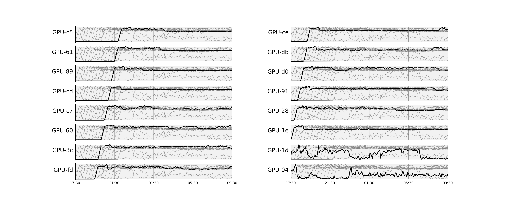
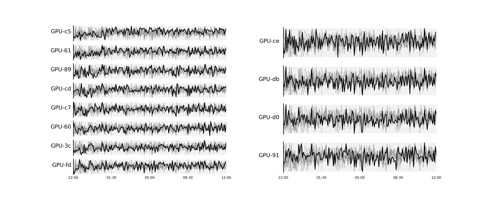

# gpu-memory-tracker
Tracks GPU memory usage over time as your simulation code is running

## Usage

The code consists of two main scipts, `nvml.py` and `nvml_reader.py`, accompanied by the plotting module `horizontal_bars_figure.py`.

To launch the tracker:
```console
$ pixi run tracker
```
This will run in the background and append GPU usage statistics to a `.csv` file once per minute.

To plot the results from the `.csv` file:
```console
$ pixi run reader -f nvml_20230531-214237.csv -s "2023-06-01 17:14" -e "2023-06-02 09:38"
```
where you replace the filename, start and end times accordingly.

Sample output:
```
                                         used_power_W                        used_gpu_memory_MiB
                                                  max        mean        std                 max          mean          std
gpu_uuid
GPU-0435bc0c-f6d1-aea8-c293-34dc683f3bbf          367  224.735926  85.705688               24501  21163.419652  1200.555189
GPU-1dfe3b5c-79a0-0422-f0d0-b22c6ded0af0          380  210.232344  93.814750               23831  20185.794268  1593.391977
GPU-1e8ab7c4-1892-d5b2-cff3-27ed68ab0cb0          371  203.268168  90.280413               25917  19064.484135  1914.924620
GPU-286afb69-cbe3-16d4-845a-95a44a732457          393  217.172979  94.241622               25375  20068.111566  2770.361860
GPU-3c1c67ff-efbc-8c7a-81fa-5a9fa1aacb6e          369  208.854383  94.394624               23939  17514.416588  3723.680108
GPU-607abfe7-dde7-bbde-e7dc-27df0c083cb3          386  217.731857  98.854606               23349  17429.276155  3812.925625
GPU-618947d4-f719-3af8-6f9a-5ad6c10717d9          383  213.703110  99.887138               23893  16419.121583  4225.272359
GPU-8903bbec-70a5-4259-bb82-c5f95d417bfe          381  209.343544  99.241505               23491  16424.200754  3968.190983
GPU-91cacd85-11ff-b3d6-ce9e-3035c49f91e0          392  229.511310  90.439730               24775  19014.547597  2374.283574
GPU-c55b3036-d54d-a885-7c6c-4238840c836e          402  230.864279  98.721442               25533  17333.577757  4708.808932
GPU-c7ebcb70-c0f3-376a-7d63-abfd5e4786e5          390  217.672479  95.850695               23237  17096.426956  3725.197609
GPU-cd37a5b2-e72d-eaa0-231c-f7abadbf1361          379  208.976437  95.956346               22979  16674.802074  3792.661263
GPU-ce697126-4112-a696-ff6b-1b072cdf03a2          379  220.402922  92.214866               22715  17681.816211  2745.141949
GPU-d0a28ddd-b3cf-6fb4-72c0-87158ddadd6e          374  216.918473  90.321331               24091  18213.516494  2847.337000
GPU-db57bc49-759c-283b-2e19-09c1a23d2676          385  218.780867  93.981904               23189  17615.459943  2504.511867
GPU-fd00ec2b-bc85-ee6f-cf6a-a92103974651          381  216.900094  94.578045               23981  17681.326107  3285.807881
nvml_20230531-214237.csv was recorded over the time interval from 2023-05-31 21:43:37.124133 to 2023-06-02 09:37:46.624458.
```

Running the reader will also generate two plots, one for memory and another for power usage over time. Here is an example for the `fbpic` PIC code running on 16 NVIDIA V100 GPUs:




_Note:_ By default only `python` processes are tracked, this can be changed inside `nvml.py`.

## Installation

We make use of the excellent [pixi](pixi.sh) package manager, which can be installed on Linux/macOS via

```console
$ curl -fsSL https://pixi.sh/install.sh | bash
```

One can then clone this repo via

```console
$ git clone git@github.com:berceanu/gpu-memory-tracker.git
```
