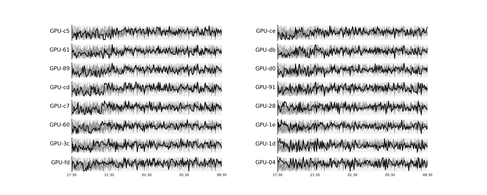

# gpu-memory-tracker
Tracks GPU memory usage over time as your simulation code is running

## Usage

The code consists of two main scipts, `nvml.py` and `nvml_reader.py`, accompanied by the plotting module `horizontal_bars_figure.py`. 

To launch the tracker:
```console
$ nohup python nvml.py > /dev/null 2>&1 &
```
This will run in the background and append GPU usage statistics to a `.csv` file once per minute.

To plot the results from the `.csv` file:
```console
$ python nvml_reader.py --filename nvml_20230531-214237.csv --start_time "2023-05-31 21:00" --end_time "2023-06-01 12:14"
```
where you replace the filename, start and end times accordingly.

Sample output:
```
                                         used_power_W                        used_gpu_memory_MiB                           
                                                  max        mean        std                 max          mean          std
gpu_uuid                                                                                                                   
GPU-3c1c67ff-efbc-8c7a-81fa-5a9fa1aacb6e          364  214.449339  91.832207               21119  16218.496035  2293.933416
GPU-607abfe7-dde7-bbde-e7dc-27df0c083cb3          386  226.164758  97.391799               22099  16539.029956  2770.936672
GPU-618947d4-f719-3af8-6f9a-5ad6c10717d9          375  222.932159  98.131933               21703  15937.905727  3587.840492
GPU-8903bbec-70a5-4259-bb82-c5f95d417bfe          381  217.628194  96.276191               20297  15936.474890  3324.847067
GPU-91cacd85-11ff-b3d6-ce9e-3035c49f91e0          392  238.274890  88.310371               22049  18072.748018   752.316903
GPU-c55b3036-d54d-a885-7c6c-4238840c836e          402  238.511013  97.264715               21837  16726.790308  3997.791707
GPU-c7ebcb70-c0f3-376a-7d63-abfd5e4786e5          389  226.874890  95.462765               20845  16768.737445  3116.849760
GPU-cd37a5b2-e72d-eaa0-231c-f7abadbf1361          374  218.773568  94.937150               20093  16351.597357  3252.064419
GPU-ce697126-4112-a696-ff6b-1b072cdf03a2          376  225.916300  90.741289               21393  17364.444934  1901.784681
GPU-d0a28ddd-b3cf-6fb4-72c0-87158ddadd6e          370  224.044053  88.645957               21293  16807.340088   693.161742
GPU-db57bc49-759c-283b-2e19-09c1a23d2676          380  225.980617  92.864362               21875  17023.218502  1349.911386
GPU-fd00ec2b-bc85-ee6f-cf6a-a92103974651          373  221.120705  93.295847               20569  16929.327753  2228.389676
nvml_20230531-214237.csv was recorded over the time interval from 2023-05-31 21:43:37.124133 to 2023-06-01 16:41:26.214446.
```

Running `nvml_reader.py` will also generate two plots, one for memory and another for power usage over time, for the `fbpic` PIC code running on 12 NVIDIA V100 GPUs:




_Note:_ By default only `python` processes are tracked, this can be changed inside `nvml.py`.

## Installation

```console
$ micromamba create -f env.yml
$ micromamba activate gpumonenv
```